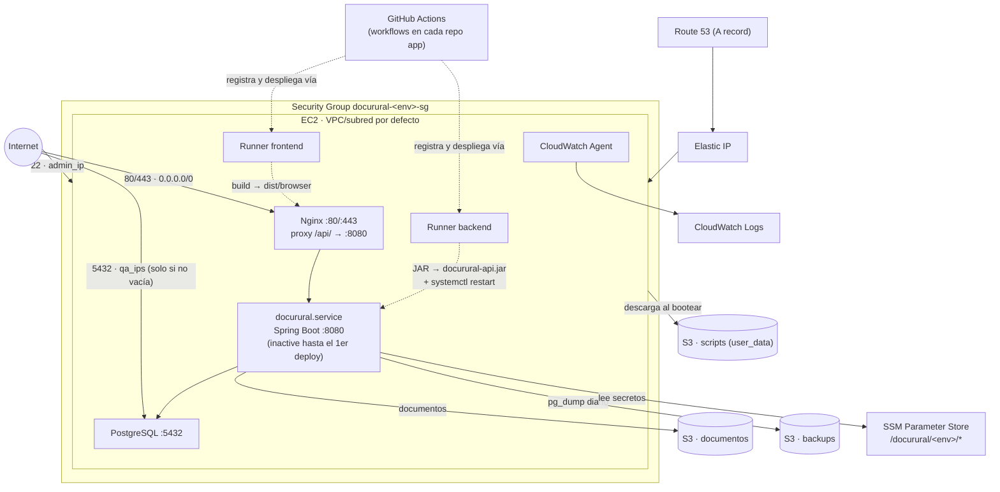

# DocuRural — Infraestructura AWS (Terraform)

Infraestructura como código (Terraform) para los entornos de DocuRural en AWS: **develop**, **qa** y **prod**. Provisiona una instancia EC2 pública con PostgreSQL, Nginx y dos runners self-hosted de GitHub Actions, más los recursos de soporte (S3, IAM, SSM, CloudWatch, Route 53 y, en prod, EventBridge).

> **Este repositorio aprovisiona solo infraestructura.** No descarga, compila ni arranca el backend ni el frontend. El despliegue de la aplicación lo hacen los runners self-hosted de GitHub Actions que esta infraestructura registra, disparados por los workflows de los repos `docurural-backend` / `docurural-frontend`. Después de un `terraform apply` limpio, `systemctl status docurural` estará `inactive` y `https://<dominio>/api/...` responderá `502` hasta el primer deploy del runner — es el comportamiento esperado, no un fallo.

## Índice

- [Arquitectura](#arquitectura)
- [Estructura del repositorio](#estructura-del-repositorio)
- [Los tres entornos](#los-tres-entornos)
- [Requisitos previos](#requisitos-previos)
- [Cómo desplegar](#cómo-desplegar)
- [Qué hacer después del apply](#qué-hacer-después-del-apply)
- [Infraestructura compartida de CI/CD](#infraestructura-compartida-de-cicd)
- [Referencia de módulos](#referencia-de-módulos)
- [Convención de nombres](#convención-de-nombres)
- [Qué hace el user_data al arrancar](#qué-hace-el-user_data-al-arrancar)
- [Pendientes y deuda técnica conocida](#pendientes-y-deuda-técnica-conocida)

## Arquitectura

Cada entorno es una única instancia EC2 pública (Ubuntu 24.04 LTS, AMI oficial de Canonical) en la **VPC y subred por defecto** de la cuenta — el repo no crea VPC, subredes, NAT ni Internet Gateway propios. Sobre esa instancia conviven:

- **PostgreSQL** local (no hay RDS).
- **Nginx** como único reverse proxy: sirve el frontend estático y expone `/api/` hacia Spring Boot en `localhost:8080`.
- El servicio systemd `docurural` — la unit se crea, pero **no se arranca** hasta que un runner despliegue el JAR.
- El **agente de CloudWatch**, enviando `/opt/docurural/logs/app.log` al log group del entorno.
- **Dos runners self-hosted de GitHub Actions** (backend y frontend), que son quienes finalmente compilan y despliegan la aplicación.

La instancia tiene una **Elastic IP** fija y un registro **A** en una hosted zone de Route 53 ya existente (se consume con `data "aws_route53_zone"`, no se crea). TLS vía **Let's Encrypt/certbot** — no hay ACM, ALB ni target groups: el propio Nginx del host termina el TLS.

Los documentos de la aplicación y los backups de `pg_dump` van a **S3**; los secretos (contraseña de DB, JWT secret) a **SSM Parameter Store**.



> Este diagrama describe un único entorno de aplicación (develop/qa/prod). No incluye el Lambda relay de
> `envs/shared` — ver [Infraestructura compartida de CI/CD](#infraestructura-compartida-de-cicd).

### Puertos expuestos

| Puerto | Origen permitido | Uso |
|---|---|---|
| 80 | `0.0.0.0/0` | HTTP; certbot lo redirige a 443 |
| 443 | `0.0.0.0/0` | HTTPS — frontend y API |
| 22 | `var.admin_ip` | SSH |
| 5432 | `var.qa_ips` | PostgreSQL / PgAdmin — solo si la lista no está vacía (cerrado en `prod`) |
| 8080 | — | Spring Boot; **no** está en el Security Group, solo alcanzable vía el proxy `/api/` de Nginx |

## Estructura del repositorio

```
terraform/
├── envs/                     # Un root module independiente por entorno (state propio)
│   ├── develop/
│   ├── qa/
│   ├── prod/
│   │   └── main.tf, variables.tf, outputs.tf, terraform.tfvars.example
│   └── shared/                # Infra de CI/CD compartida por la organización (no es un entorno de app)
│       └── main.tf, variables.tf, outputs.tf, terraform.tfvars.example
├── modules/                  # Módulos reutilizables entre entornos
│   ├── s3/            documentos + backups + scripts
│   ├── iam/            role e instance profile del EC2
│   ├── ssm/            parámetros /docurural/<env>/*
│   ├── cloudwatch/      log group + billing budget
│   ├── ec2/             security group + key pair + instancia + EIP
│   ├── route53/         registro A
│   ├── eventbridge/     apagado/encendido automático (solo prod)
│   └── github-webhook-relay/  Lambda relay del webhook de Projects v2 (usado por envs/shared)
└── scripts/
    └── user_data.sh.tftpl    # Plantilla de arranque, renderizada por el módulo ec2
```

Cada entorno bajo `envs/` es un root module completo: tiene su propio `terraform init` y su propio `.tfstate` local. No comparten estado entre sí. `envs/shared` sigue el mismo patrón pero no es un entorno de la aplicación — ver [Infraestructura compartida de CI/CD](#infraestructura-compartida-de-cicd).

## Los tres entornos

| | develop | qa | prod |
|---|---|---|---|
| Dominio | `dev.ccplsolutions.link` | `pruebas.ccplsolutions.link` | `app.ccplsolutions.link` |
| Tipo de instancia | `t3.micro` | `t3.small` | `t3.small` |
| Disco (EBS) | 10 GB | 20 GB | 30 GB |
| Perfil Spring | `develop` | `qa` | `prod` |
| Expiración JWT | 30 min | 30 min | 8 h |
| Versioning en S3 (docs) | no | no | sí |
| PostgreSQL remoto (5432) | sí (`qa_ips`) | sí (`qa_ips`) | no (cerrado) |
| Presupuesto mensual | $10 | $15 | $30 |
| Apagado/encendido automático | no | no | sí — EventBridge, 22:00/06:00 L–V, America/Bogota |
| Labels de los runners | `develop,docurural-backend` / `develop,docurural-frontend` | `qa,docurural-backend` / `qa,docurural-frontend` | `prod,docurural-backend` / `prod,docurural-frontend` |

> **Sobre `t3.micro` en develop**: es un tipo de instancia válido para el módulo `ec2`, pero liviano — con PostgreSQL y dos runners compilando (Maven + `npm run build`) en 1 GB de RAM hay riesgo de quedarse sin memoria. El `user_data` crea un swapfile de 2 GB para mitigarlo. Si se ven fallos de build por falta de memoria, subir `instance_type` a `t3.small` en `terraform.tfvars` y volver a aplicar.

## Requisitos previos

- **AWS CLI** configurado con credenciales que puedan crear los recursos anteriores.
- **Terraform** >= 1.6.0.
- Una **hosted zone de Route 53 ya existente** para el dominio raíz (`ccplsolutions.link`); el repo no la crea, solo añade el registro A.
- Un **par de claves SSH por entorno**. El nombre del `.pub` debe coincidir con el default de `ssh_public_key_path` de cada entorno:
  ```bash
  ssh-keygen -t ed25519 -f ~/.ssh/docurural-develop-key -C "docurural-develop"
  ssh-keygen -t ed25519 -f ~/.ssh/docurural-qa-key      -C "docurural-qa"
  ssh-keygen -t ed25519 -f ~/.ssh/docurural-prod-key    -C "docurural-prod"
  ```
- Un **Personal Access Token de GitHub** con permisos `repo` y `read:packages`, usado para registrar los runners self-hosted. Se recomienda uno distinto por entorno.

## Cómo desplegar

El flujo es el mismo en los tres entornos — solo cambia el directorio:

```bash
cd terraform/envs/develop      # o qa / prod
cp terraform.tfvars.example terraform.tfvars
# completar terraform.tfvars con los valores reales (ver abajo)

terraform init
terraform plan  -var-file=terraform.tfvars
terraform apply -var-file=terraform.tfvars
```

Para eliminar todos los recursos de un entorno:

```bash
terraform destroy -var-file=terraform.tfvars
```

Puntos a tener en cuenta:

- `terraform.tfvars` está en `.gitignore` (`*.tfvars`, con excepción de `terraform.tfvars.example`). **Nunca** se sube a Git — contiene contraseñas, el PAT de GitHub y direcciones IP.
- Cada entorno tiene su propio `.tfstate` local en su directorio; hay que correr `terraform init` una vez por cada uno.
- El orden de creación de módulos (`s3 → iam → ssm → cloudwatch → ec2 → route53`, y `eventbridge` solo en prod) lo resuelve Terraform automáticamente por dependencias — no hace falta forzarlo con `-target`.
- Variables sin valor por defecto que `terraform apply` pedirá si faltan en el `.tfvars`: `admin_ip`, `qa_ips` (no existe en prod), `route53_zone_id`, `certbot_email`, `db_password`, `admin_seed_password`, `jwt_secret`, `github_pat`, `github_repo`, `github_repo_frontend`, `alert_email`.

## Qué hacer después del apply

El `user_data` tarda entre 10 y 15 minutos en completarse. Se puede seguir por SSH:

```bash
ssh -i ~/.ssh/docurural-<env>-key ubuntu@<elastic_ip>
tail -f /var/log/docurural-init.log
```

El log debe llegar a `[12/12]` y mostrar el banner final. A partir de ahí:

- `systemctl is-active docurural` devolverá `inactive` — es lo esperado, todavía no hay aplicación desplegada.
- La API queda publicada en el output `api_base_url` (`terraform output api_base_url`, equivalente a `https://<dominio>/api`) y **responderá `502`** hasta que un runner despliegue el JAR. Un `502` con cabecera `Server: nginx` confirma que la infraestructura (SG, DNS, TLS, proxy) funciona correctamente.
- Los dos runners deben aparecer como **Idle** en `Settings → Actions → Runners` de cada repositorio de aplicación (`docurural-backend`, `docurural-frontend`). A partir de ahí, cualquier workflow con el label correspondiente (ver tabla de entornos) desplegará la app.

## Infraestructura compartida de CI/CD

Además de los tres entornos de aplicación, `terraform/envs/shared/` provisiona un **Lambda relay** entre el
webhook de organización de GitHub (`projects_v2_item`) y `docurural-backend`. No es infraestructura de un
entorno de app (no aparece en el diagrama de arquitectura de más arriba) — es global a la organización:
existe una sola vez, independientemente de cuántos entornos develop/qa/prod haya desplegados, y su ciclo de
vida no depende del de ninguno de ellos.

**Qué hace**: recibe el POST del webhook, verifica la firma `X-Hub-Signature-256`, filtra solo eventos
`projects_v2_item` / `edited` sobre un `Issue` cuyo campo editado sea `Status`, y si pasa el filtro dispara un
`repository_dispatch` (`event_type: project-status-changed`) en `docurural-backend` con el `content_node_id`
del issue editado como `client_payload`.

```
Webhook org GitHub → Lambda (Function URL) → repository_dispatch → project-cascade.yml → update_project_status.py (modo cascade)
```

Toda la lógica de negocio (confirmar que el issue es el padre de la release y propagar el estado a sus
sub-issues) vive en `.github/scripts/update_project_status.py` de `docurural-backend`, disparado por
`.github/workflows/project-cascade.yml`. Este Lambda no sabe nada de releases ni de sub-issues.

### Desplegar

```bash
cd terraform/envs/shared
cp terraform.tfvars.example terraform.tfvars
# completar github_webhook_secret (openssl rand -hex 32) y github_dispatch_token (PAT classic, scope repo)

terraform init
terraform plan  -var-file=terraform.tfvars
terraform apply -var-file=terraform.tfvars
```

Un cambio en `terraform/modules/github-webhook-relay/src/index.mjs` se redespliega solo en el siguiente
`apply` (el `source_code_hash` del Lambda cambia) — a diferencia del Lambda descrito originalmente en el
spec, aquí no hace falta re-zipear ni subir nada a mano.

### Registrar el webhook en la organización

Esto **no lo hace Terraform** — la API de GitHub para gestionar webhooks de organización no tiene un
provider maduro en este repo, y es una operación de una sola vez. Requiere ser owner de `CCPL-Solutions`:

1. `terraform output webhook_relay_url` → copiar el valor.
2. `https://github.com/organizations/CCPL-Solutions/settings/hooks` → **Add webhook**.
3. **Payload URL**: la Function URL del paso 1. **Content type**: `application/json`. **Secret**: el mismo
   `github_webhook_secret` usado en el `apply`.
4. **Which events**: *Let me select individual events* → marcar únicamente **Projects v2 item**.
5. Guardar. GitHub manda un evento `ping` inmediatamente — debe verse un `204` en *Recent Deliveries*.

### Verificar

- *Recent Deliveries* del webhook debe mostrar `204` en cada entrega tras mover una tarjeta.
- `terraform output webhook_relay_log_command` da el comando para seguir los logs en vivo
  (`aws logs tail /aws/lambda/docurural-github-webhook-relay --follow`).
- Mover la tarjeta del issue padre en el tablero → debe aparecer un run de `project-cascade.yml` en Actions
  unos segundos después. Mover la tarjeta de un issue que **no** es el padre → no debe disparar nada visible
  en Actions (el relay reenvía igual; `update_project_status.py` en modo `cascade` lo descarta
  silenciosamente al comparar `content_node_id` contra el issue padre configurado).

## Referencia de módulos

| Módulo | Crea | Outputs principales |
|---|---|---|
| `s3` | 3 buckets: documentos, backups (lifecycle de expiración a 90 días) y scripts (nombre con sufijo `random_id` para unicidad global); public access block en los tres; versioning condicional en documentos | `docs_bucket_name/arn`, `backups_bucket_name/arn`, `scripts_bucket_name/id/arn` |
| `iam` | Role EC2 con `AmazonSSMManagedInstanceCore` + política inline de mínimo privilegio (S3 docs/backups CRUD, S3 scripts solo lectura, CloudWatch Logs, SSM `GetParameter*` scopeado a `/docurural/<env>/*`) + instance profile | `role_name`, `role_arn`, `instance_profile_name` |
| `ssm` | 5 parámetros bajo `/docurural/<env>/*` (`db-password` y `jwt-secret` como `SecureString`; el resto `String`) | `db_password_arn`, `jwt_secret_arn`, `parameter_path` |
| `cloudwatch` | Log group con retención de 30 días + budget mensual con alerta al 80% del límite | `log_group_name`, `log_group_arn` |
| `ec2` | Objeto S3 con el `user_data` renderizado, key pair, security group, instancia EC2, Elastic IP + asociación | `instance_id`, `instance_arn`, `elastic_ip`, `security_group_id` |
| `route53` | Registro A (TTL 300) apuntando la Elastic IP | `fqdn` |
| `eventbridge` | Role de Scheduler + 2 `aws_scheduler_schedule` (apagado 22:00 / encendido 06:00, L–V) — **solo instanciado en prod** | `apagado_schedule_arn`, `encendido_schedule_arn` |
| `github-webhook-relay` | Lambda (Node 20.x) + Function URL (`auth NONE`) + permission + role de ejecución + log group — instanciado en `envs/shared`, no en develop/qa/prod | `function_url`, `function_name`, `function_arn`, `log_group_name` |

Dos detalles del módulo `ec2` que conviene tener presentes:

- El `user_data` real supera el límite de 16 KB de EC2, así que vive renderizado en S3; la instancia solo ejecuta un bootstrap de ~10 líneas que instala AWS CLI y lo descarga (`terraform/modules/ec2/main.tf:151-163`).
- `user_data_replace_on_change = false`: **editar `user_data.sh.tftpl` no re-ejecuta el script en instancias ya creadas**, solo sube el objeto nuevo a S3. Para aplicar el cambio hay que recrear la instancia (`terraform taint`/`apply`) o correr el script manualmente por SSH.

`spring_profile` debe coincidir siempre con el nombre del entorno (`env`): `backup.sh`, dentro del `user_data`, lee el secreto en `/docurural/${spring_profile}/db-password`, así que un desajuste rompe el backup diario.

## Convención de nombres

`env` (`develop` / `qa` / `prod`) genera automáticamente: `docurural-<env>-sg`, `-ec2-role`, `-minimal-policy`, `-ec2-profile`, `-budget`, `-eip`, el bucket `docurural-<env>-scripts-<hex>` y el path SSM `/docurural/<env>/*`.

No derivan de `env` y deben pasarse explícitos en cada `terraform.tfvars`: nombres de los buckets de documentos/backups, el log group de CloudWatch, el nombre del key pair, el dominio, y los nombres/labels de los runners.

## Qué hace el user_data al arrancar

`terraform/scripts/user_data.sh.tftpl` ejecuta, en orden, al primer boot de la instancia:

1. Actualiza el sistema e instala utilidades base.
2. Instala Java 17, Maven y Node.js 20 — **toolchain de compilación para los runners**, no para la infraestructura en sí.
3. Instala y configura PostgreSQL (escucha en `0.0.0.0` solo si `pg_remote_access = true`).
4. Instala Nginx.
5. Crea la estructura de directorios en `/opt/docurural` y un `index.html` placeholder (para que Nginx y el reto HTTP-01 de certbot tengan algo que servir antes del primer deploy real). *(5b)* Configura un swapfile de 2 GB.
6. Genera `/opt/docurural/backend/.env` (sin secretos — esos los inyecta Spring Cloud AWS desde SSM).
7. Crea la unit systemd `docurural.service` (sin arrancarla).
8. Configura el vhost de Nginx, incluido el proxy `/api/` hacia `localhost:8080`.
9. Emite el certificado TLS con certbot (espera hasta 5 minutos a que el DNS propague).
10. Instala y configura el agente de CloudWatch.
11. Crea `backup.sh` y su cron diario (`pg_dump` → S3, 2 AM).
12. Instala y registra los dos runners self-hosted de GitHub Actions (backend y frontend), con permisos `sudo` mínimos para que puedan gestionar el servicio `docurural` y recargar Nginx.

## Pendientes y deuda técnica conocida

- **Rotar el PAT de GitHub.** Está en texto plano en `terraform/envs/qa/terraform.tfvars` y en el `terraform.tfvars` legacy de la raíz; además queda embebido en el `user_data.sh` renderizado dentro del bucket S3 de scripts y en los `.tfstate` locales. Usar un token distinto por entorno. El mismo problema aplica a `github_dispatch_token` en `terraform/envs/shared/terraform.tfvars` y en su `.tfstate` local — el Lambda lo recibe como variable de entorno en texto plano (visible en la consola de AWS), igual que el resto de secretos de este repo.
- **Habilitar el backend remoto de Terraform.** Hoy el bloque `backend "s3"` está comentado en los cuatro `envs/*/main.tf` (incluido `shared`); el estado vive local. Para habilitarlo:
  1. Crear manualmente el bucket `docurural-terraform-state` (con versioning y encriptación) y una tabla DynamoDB `docurural-terraform-locks` (clave de partición `LockID`).
  2. Descomentar el bloque `backend "s3"` en `envs/<env>/main.tf`, ajustando `key` por entorno (`docurural/<env>/terraform.tfstate`, `docurural/shared/terraform.tfstate`).
  3. Ejecutar `terraform init -migrate-state` en cada entorno.
- **Nombres legacy en QA.** `terraform/envs/qa/terraform.tfvars` todavía usa `docurural-test-*` (buckets, log group) pese al rename de entorno de `"test"` a `"qa"`; cambiarlos implica recrear recursos con estado vivo.
- **Archivos legacy en la raíz.** `terraform.tfvars`, `terraform.tfstate`, `terraform.tfstate.backup` y `.terraform.lock.hcl` en la raíz del repo son sobrantes de la estructura monolítica anterior a la modularización; ningún `.tf` los referencia ya.
- **`modules/eventbridge` no está parametrizado por entorno.** Los nombres del role, la política y los dos schedules están hardcodeados a `prod`; instanciar este módulo en un segundo entorno colisionaría con los recursos existentes. Habría que parametrizar `env` antes de reutilizarlo fuera de prod.
